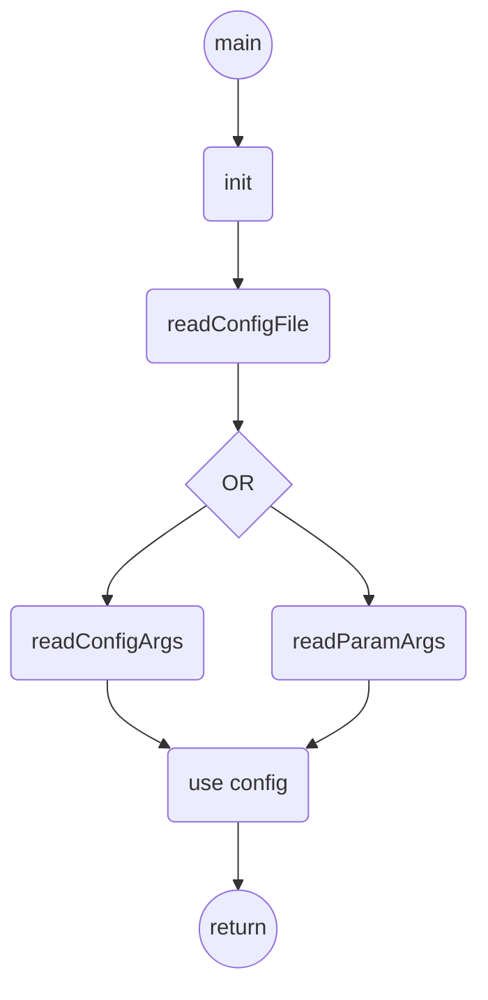

# config

## Purpose

This lib can be used to parse commands lines arguments or formatted config files for C/C++ projects.

## Usage
Tree example:
```shell
.
├── makefile
└── src
    ├── lib
    │   └── config
    │      ├── config_arg.c
    │      ├── config_arg.h
    │      ├── config_data.h
    │      ├── config_file.c
    │      ├── config_file.h
    │      ├── LICENSE
    │      └── README.md
    └── main.c
```

Code example:
```C
#include <stdio.h>

#include "lib/config/config_arg.h" // parse command line arguments
#include "lib/config/config_file.h" // read config file

int main ( int argc, char *argv[] )
{
	uint8_t param1 = 0;
	uint8_t param3[ 10 ] = { 0 };
	char param2[ 256 ] = { 0 };

	uint8_t i = 0;

	config_el config[] = { // config file
		{ "PARAM_1", cT ( uint8_t ), &param1, "first parameter" },
		{ "PARAM_2", cT ( str ), param2, "second parameter" },
		{ NULL, 0, NULL, NULL}
	};

	param_el param[] = { // cmd line args
		{ "-p1", 1, cT ( uint8_t ), &param1, "first argument" },
		{ "--param1", 1, cT ( uint8_t ), &param1, "first argument" },
		{ "-p3", 10, cT ( uint8_t ), &param3, "third argument" },
		{ "--param3", 10, cT ( uint8_t ), &param3, "third argument" },
		{ NULL, 0, 0, NULL, NULL }
	};

	if ( readConfigFile ( "configFilePath", config ) )
	{
		// failure case
	}
	// use readConfigArgs() or readParamArgs() not the both in the same code
	else if ( readConfigArgs ( argc, argv, config ) )
	{
		// failure case
	}
	else if ( readParamArgs ( argc, argv, param ) )
	{
		// failure case
	}
	else
	{
		// configFile read successfully
	}

	printf ( "1 - %d\n", param1 );
	printf ( "2 - %s\n", param2 );

	for ( i = 0; i < 10; i++ )
	{
		printf ( "3 - %d - %d\n", i, param3[ i ] );
	}

	return ( 0 );
}
```

configFilePath example:
```
# param 1
# default value:
# PARAM_1=12
PARAM_1=10

# param 2
# default value:
# PARAM_2=pony
PARAM_2=str
```

Call example: using **readConfigFile()** only
```
$ ./exec

1 - 6
2 - str
...
```

Call example: using **readConfigFile()** and **readConfigArgs()**
```
$ ./exec PARAM_2=test

1 - 6
2 - test
...
```

Call example: using **readConfigFile()** and **readParamArgs()**
```
$ .//exec -p1 5 -p3 1 2 3 4 5 6 135 8 9

1 - 5
2 - str
3 - 0 - 1
3 - 1 - 2
3 - 2 - 3
3 - 3 - 4
3 - 4 - 5
3 - 5 - 6
3 - 6 - 135
3 - 7 - 8
3 - 8 - 9
3 - 9 - 0
```

The last call overwrite the existing values:

