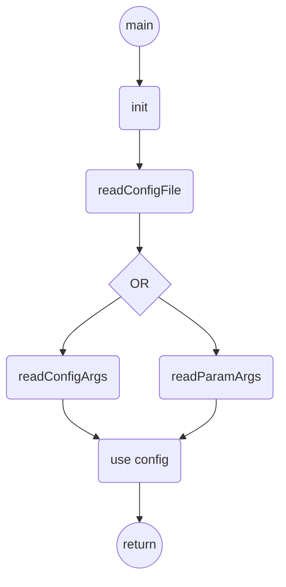

# config

## Purpose

This lib can be used to parse commands lines arguments or formatted config files for C/C++ projects.

## Usage
Tree example:
```shell
.
├── makefile
└── src
    ├── lib
    │   └── config
    │      ├── config_arg.c
    │      ├── config_arg.h
    │      ├── config_data.h
    │      ├── config_file.c
    │      ├── config_file.h
    │      ├── LICENSE
    │      └── README.md
    └── main.c
```

Code example:
```C
#include <stdio.h>

#include "lib/config/config_arg.h" // parse command line arguments
#include "lib/config/config_file.h" // read config file

int main ( int argc, char *argv[] )
{
	uint8_t param1 = 0;
	uint8_t param3[ 10 ] = { 0 };
	char param2[ 256 ] = { 0 };
	char * param4[ 3 ] = { 0 };
	char param5[ 3 ][ 256 ] = { 0 };

	uint8_t i = 0;

	config_el config[] = { // config file
		{ "PARAM_1", cT ( uint8_t ), &param1, "first parameter" },
		{ "PARAM_2", cT ( str ), param2, "second parameter" },
		{ NULL, 0, NULL, NULL}
	};

	param_el param[] = { // cmd line args
		{ 
			.key = "-p1",
			.nbEl = 1, 
			.type = cT ( uint8_t ), 
			.value = &param1, 
			.help = "first argument" 
		},
		{ 
			.key = "--param1",
			.nbEl = 1, 
			.type = cT ( uint8_t ), 
			.value = &param1, 
			.help = "first argument" 
		},
		{ "-p2", 1, cT ( str ), &param2, "second argument" },
		{ "--param2", 1, cT ( str ), &param2, "second argument" },
		{ "-p3", 10,  cT ( uint8_t ),  &param3,  "third argument" },
		{ "--param3", 10,  cT ( uint8_t ),  &param3,  "third argument" },
		{ "-p4", 3,  cT ( str ),  &param4,  "fourth argument" },
		{ "--param4", 3,  cT ( str ),  &param4,  "fourth argument" },
		{ NULL }
	};

	if ( readConfigFile ( "configFilePath", config ) )
	{
		// failure case
	}
	else if ( readConfigArgs ( argc, argv, config ) )
	{
		// failure case
	}
	else if ( readParamArgs ( argc, argv, param ) )
	{
		// failure case
	}
	else
	{
		// configFile read successfully
	}

	printf ( "1 - %d\n", param1 );
	printf ( "2 - %s\n", param2 );
	printf ( "3 -\n" );

	for ( i = 0; i < 10; i++ )
	{
		printf ( "    %d - %d\n", i, param3[ i ] );
	}

	printf ( "4 -\n" );
	for ( i = 0; i < 3; i++ )
	{
		printf ( "    %d - %s\n", i, param4[ i ] );
	}

	return ( 0 );
}
```

configFilePath example:
```
# param 1
# default value:
# PARAM_1=12
PARAM_1=6

# param 2
# default value:
# PARAM_2=pony
PARAM_2=str
```

Call example: using **readConfigFile()** only
```
$ ./exec

1 - 6
2 - str
...
```

Call example: using **readConfigFile()** and **readConfigArgs()**
```
$ ./exec PARAM_2=test

1 - 6
2 - test
...
```

Call example: using **readConfigFile()** and **readParamArgs()**
```
$ ./exec -p1 5 -p3 1 2 3 4 5 6 135 8 9

1 - 5
2 - str
3 - 0 - 1
3 - 1 - 2
3 - 2 - 3
3 - 3 - 4
3 - 4 - 5
3 - 5 - 6
3 - 6 - 135
3 - 7 - 8
3 - 8 - 9
3 - 9 - 0
...
```

Call example: using **readConfigFile()**, **readConfigArgs** and **readParamArgs()**
```
$  ./bin/exec PARAM_2=string_2 -p4 test test_2

1 - 10
2 - string_2
...
4 -
    0 - test
    1 - test_2
    2 - (null)
```

Be care with paramtters order: 
```
$  ./bin/exec PARAM_2=string_2 -p4 test test_2
1 - 10
2 - string_2
...
4 -
    0 - test
    1 - test_2
    2 - (null)
```
is different than:
```
$  ./bin/exec -p4 test test_2 PARAM_2=string_2
1 - 10
2 - string_2
...
4 -
    0 - test
    1 - test_2
    2 - PARAM_2
```


The last call overwrite the existing values:


Need to be done next: 
- [x] read files of config
- [x] read arguments on command lines 
- [x] read parameters on command lines 
- [x] read command args and parameters 
- [x] use NULL pointer to get argument from command line
